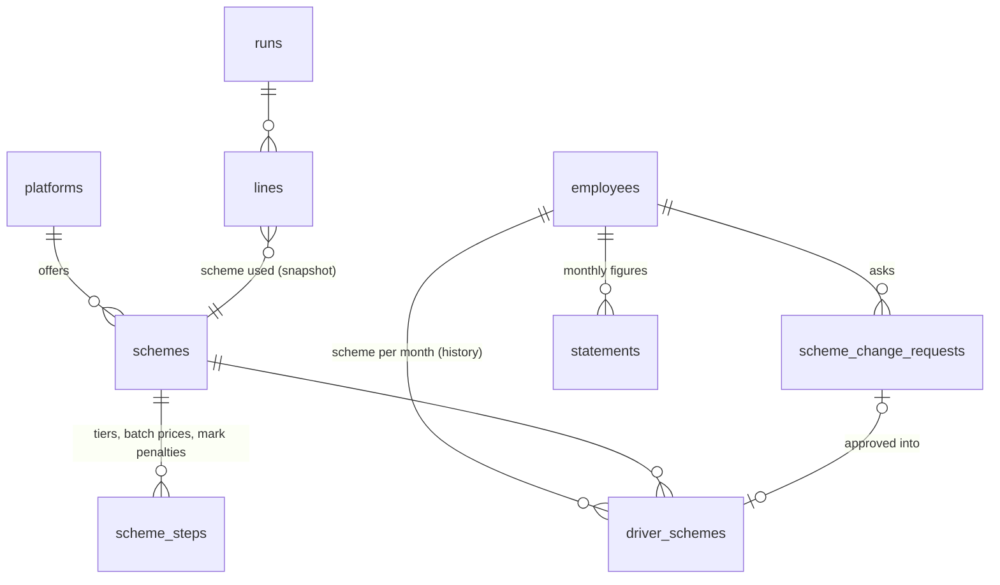

# Pay schemes per platform, tiers and penalties, and scheme change requests

Design for the next payroll step. It extends the payroll module that already exists (`backend/app/modules/payroll`,
PostgreSQL schema `payroll`); it does not start a new system.

## 0. Where this fits

**Stack.** The request mentions Laravel or Node.js. The backend is FastAPI on PostgreSQL 16, and payroll already runs on it:
- platforms as data, built from the client's salary template;
- the driver's monthly statement, with screenshots and a review step;
- monthly runs, with installments under the cap, approval, a lock and reopen;
- the Excel export in the client's own columns, and the payslip in the app.

Rewriting this in another language would throw away work that is tested and running. Everything below is the same
module, in its conventions:
- forward-only SQL migrations;
- `snake_case` constraint names;
- money as `numeric(12,3)` (KWD, fils);
- names as `{"ar", "en"}`.

**What changes.**

| Today | After |
|---|---|
| One pay rule per platform: basic salary yes/no, a rate per order, per hour and per valid day, and the invalid-days rule | A platform has one or more **schemes**, and each driver has a scheme per month |
| — | Each scheme names a **calculator** (the strategy) and holds its numbers |
| — | Today's per-platform rule becomes a `platform_rates` calculator, so nothing that works today changes |

**Strategies by the shape of the rule, not by platform name.** A `KeetaStrategy` class would put a platform's name
and prices in code. The project forbids that (`tests/test_architecture.py`: client and platform names are data), and
it would mean a code change every time Keeta moves a price. Talabat also has two shapes (batch and fixed price). So:

| Calculator | Shape | Used by |
|---|---|---|
| `platform_rates` | basic + per order + per hour + per valid day, and the invalid-days rule (today's engine) | existing platforms |
| `per_order` | one price per order, and an optional missing-target deduction | Talabat fixed price 1, 2, 3 |
| `batch` | the price per order depends on the month's batch level | Talabat batch system |
| `tiered_target` | base price, tier bonuses, missing-target deduction, attendance marks, reduced price | Keeta |

What needs code and what does not:
- **A new platform** whose rules fit one of these shapes needs no code. It is rows in `schemes` and
  `scheme_steps`, entered from the dashboard.
- **A new shape** of rule needs one new class, registered in one dictionary, plus its name added to the column's
  CHECK constraint. The run engine does not change.

## 1. Schema



**Configuration** (business rules, changed by the office, never by a payroll run):

```sql
-- migration 0017_pay_schemes (forward-only, ends with SELECT public.fleet_apply_grants();)

CREATE TABLE payroll.schemes (
    id                    bigint GENERATED ALWAYS AS IDENTITY CONSTRAINT schemes_pkey PRIMARY KEY,
    public_id             uuid NOT NULL DEFAULT gen_random_uuid() CONSTRAINT schemes_public_id_key UNIQUE,
    platform_id           bigint NOT NULL CONSTRAINT schemes_platform_id_fkey REFERENCES payroll.platforms (id),
    code                  text NOT NULL,                       -- e.g. batch, fixed_1, fixed_2, fixed_3, standard
    name                  jsonb NOT NULL,                      -- {"ar": "...", "en": "..."}
    description           jsonb,                               -- what the driver reads in the app before asking
    calculator            text NOT NULL CONSTRAINT schemes_calculator_check
                              CHECK (calculator IN ('platform_rates', 'per_order', 'batch', 'tiered_target')),
    per_order             numeric(12,3),                       -- the base price (fixed price, Keeta base)
    target_orders         integer NOT NULL DEFAULT 420,
    required_valid_days   smallint NOT NULL DEFAULT 28,
    missing_order_rate    numeric(12,3),                       -- per order short of the target; NULL: none
    reduced_rate          numeric(12,3),                       -- every order's price when the month is reduced
    -- the ambiguous rules, as data (section 6): the client's answer is a setting, not a code change
    bonus_when_reduced    boolean NOT NULL DEFAULT false,
    marks_when_reduced    boolean NOT NULL DEFAULT false,
    floor_at_zero         boolean NOT NULL DEFAULT true,
    company_covers        text[] NOT NULL DEFAULT '{}' CONSTRAINT schemes_company_covers_check
                              CHECK (company_covers <@ ARRAY['maintenance','housing','gas','sim']),
    driver_selectable     boolean NOT NULL DEFAULT true,       -- offered in the app
    is_active             boolean NOT NULL DEFAULT true,
    created_by            bigint NOT NULL,
    created_at            timestamptz NOT NULL DEFAULT now(),
    CONSTRAINT schemes_platform_id_key UNIQUE (platform_id, code),
    CONSTRAINT schemes_rates_check CHECK (
        (calculator <> 'per_order'     OR per_order IS NOT NULL) AND
        (calculator <> 'tiered_target' OR (per_order IS NOT NULL AND reduced_rate IS NOT NULL)))
);

-- list-shaped rules, one table: a threshold and what it gives
CREATE TABLE payroll.scheme_steps (
    scheme_id  bigint NOT NULL CONSTRAINT scheme_steps_scheme_id_fkey REFERENCES payroll.schemes (id) ON DELETE CASCADE,
    kind       text NOT NULL CONSTRAINT scheme_steps_kind_check
                   CHECK (kind IN ('batch_rate', 'tier_bonus', 'marks_deduction', 'marks_reduce')),
    threshold  numeric(12,3) NOT NULL,   -- batch level | minimum orders | minimum marks
    amount     numeric(12,3),            -- price per order | bonus | deduction | (none for marks_reduce)
    CONSTRAINT scheme_steps_pkey PRIMARY KEY (scheme_id, kind, threshold),
    CONSTRAINT scheme_steps_amount_check CHECK ((kind = 'marks_reduce') = (amount IS NULL))
);
```

**A scheme is never edited once a driver has been paid on it.** A change of price is a new scheme. The office moves
the drivers to it from a month, in one bulk action. A draft run that is recomputed later must not pick up a price
the month did not have; approved runs are already locked in their cells.

**Assignment and requests** (who is on what, and when):

```sql
CREATE TABLE payroll.scheme_change_requests (
    id                   bigint GENERATED ALWAYS AS IDENTITY CONSTRAINT scheme_change_requests_pkey PRIMARY KEY,
    public_id            uuid NOT NULL DEFAULT gen_random_uuid() CONSTRAINT scheme_change_requests_public_id_key UNIQUE,
    employee_id          bigint NOT NULL CONSTRAINT scheme_change_requests_employee_id_fkey REFERENCES people.employees (id),
    company_id           bigint NOT NULL,
    current_scheme_id    bigint CONSTRAINT scheme_change_requests_current_scheme_id_fkey REFERENCES payroll.schemes (id),
    requested_scheme_id  bigint NOT NULL CONSTRAINT scheme_change_requests_requested_scheme_id_fkey REFERENCES payroll.schemes (id),
    effective_month      date NOT NULL,                      -- first day of the month it would apply from
    status               text NOT NULL DEFAULT 'pending' CONSTRAINT scheme_change_requests_status_check
                             CHECK (status IN ('pending', 'approved', 'rejected', 'cancelled')),
    driver_note          text,
    admin_note           text,                               -- required to reject (service)
    submitted_by_device  bigint,
    decided_by           bigint,
    decided_at           timestamptz,
    created_at           timestamptz NOT NULL DEFAULT now(),
    version              integer NOT NULL DEFAULT 1,
    CONSTRAINT scheme_change_requests_month_check CHECK (extract(day FROM effective_month) = 1),
    CONSTRAINT scheme_change_requests_change_check CHECK (requested_scheme_id IS DISTINCT FROM current_scheme_id),
    CONSTRAINT scheme_change_requests_decided_check CHECK ((status IN ('pending', 'cancelled')) = (decided_at IS NULL))
);
-- one open request per driver
CREATE UNIQUE INDEX scheme_change_requests_employee_id_idx
    ON payroll.scheme_change_requests (employee_id) WHERE status = 'pending';

CREATE TABLE payroll.driver_schemes (
    id           bigint GENERATED ALWAYS AS IDENTITY CONSTRAINT driver_schemes_pkey PRIMARY KEY,
    employee_id  bigint NOT NULL CONSTRAINT driver_schemes_employee_id_fkey REFERENCES people.employees (id),
    scheme_id    bigint NOT NULL CONSTRAINT driver_schemes_scheme_id_fkey REFERENCES payroll.schemes (id),
    valid_from   date NOT NULL,                              -- first day of a month
    valid_to     date,                                       -- exclusive, first day of a month; NULL: still on it
    source       text NOT NULL CONSTRAINT driver_schemes_source_check
                     CHECK (source IN ('office', 'registration', 'request', 'import')),
    request_id   bigint CONSTRAINT driver_schemes_request_id_fkey REFERENCES payroll.scheme_change_requests (id),
    set_by       bigint,
    set_at       timestamptz NOT NULL DEFAULT now(),
    CONSTRAINT driver_schemes_month_check CHECK (extract(day FROM valid_from) = 1 AND
                                                 (valid_to IS NULL OR (extract(day FROM valid_to) = 1 AND valid_to > valid_from))),
    -- btree_gist is already installed (0001); custodies use the same guarantee
    CONSTRAINT driver_schemes_overlap EXCLUDE USING gist
        (employee_id WITH =, daterange(valid_from, valid_to) WITH &&)
);
```

Two rules the database cannot hold, so the service checks them in the same transaction:
- A scheme's platform must be the driver's platform (`people.employees.platform_id`).
- A month that already has an approved run cannot be reassigned.

**Transactional** (the month's figures and the result). These extend tables that already exist:

```sql
ALTER TABLE payroll.statements                  -- the monthly performance, reviewed before payroll
    ADD COLUMN batch_level       smallint,      -- Talabat batch system: from Talabat's partner report
    ADD COLUMN attendance_marks  smallint,      -- Keeta: from Keeta's partner report
    ADD COLUMN star_day_failed   boolean;       -- Keeta: from Keeta's partner report

ALTER TABLE payroll.lines
    ADD COLUMN scheme_id  bigint CONSTRAINT lines_scheme_id_fkey REFERENCES payroll.schemes (id),
    ADD COLUMN breakdown  jsonb NOT NULL DEFAULT '[]'::jsonb;  -- the calculator's items: code, amount, why
```

`orders` and `valid_days` are already on the statement. **The three new figures are entered by the reviewer, from the
platforms' partner reports. The driver never declares them.** A driver who declares his own attendance marks will
declare zero. The same is true of valid days today, which is why the reviewer compares them with what the system
recorded.

## 2. Calculators (the Strategy pattern)

```python
# app/modules/payroll/calculators.py
"""How a scheme turns a month's figures into earnings. One calculator per shape of rule, never per platform: a
platform and its schemes are data (payroll.schemes, payroll.scheme_steps) naming their calculator."""

@dataclass(frozen=True)
class Step:
    threshold: Decimal
    amount: Decimal | None


@dataclass(frozen=True)
class Rules:  # one scheme, read once per run
    per_order: Decimal | None
    target_orders: int
    required_valid_days: int
    missing_order_rate: Decimal | None
    reduced_rate: Decimal | None
    bonus_when_reduced: bool
    marks_when_reduced: bool
    floor_at_zero: bool
    steps: dict[str, list[Step]]  # by kind, sorted by threshold

    def highest(self, kind: str, value) -> Step | None:
        """The highest step reached: tiers and marks are not cumulative."""
        reached = [s for s in self.steps.get(kind, []) if value >= s.threshold]
        return reached[-1] if reached else None

    def exact(self, kind: str, value) -> Step | None:
        return next((s for s in self.steps.get(kind, []) if s.threshold == value), None)


@dataclass(frozen=True)
class Month:  # the approved statement
    orders: int
    valid_days: int | None
    batch_level: int | None
    attendance_marks: int
    star_day_failed: bool


@dataclass(frozen=True)
class Item:
    code: str        # a salary-sheet column (columns.py), so the export and the payslip show it
    amount: Decimal  # signed: earnings positive, penalties negative
    why: dict        # what the payslip says: "540 orders reached tier 3", "3 attendance marks"


class Calculator(Protocol):
    code: str
    needs: tuple[str, ...]  # statement figures without which the line is flagged and blocks approval

    def items(self, rules: Rules, month: Month) -> list[Item]: ...


CALCULATORS: dict[str, Calculator] = {}


def calculator(cls):
    CALCULATORS[cls.code] = cls()
    return cls


def earnings(rules: Rules, calc: Calculator, month: Month) -> tuple[list[Item], Decimal]:
    items = calc.items(rules, month)
    total = sum((i.amount for i in items), ZERO)
    if total < 0 and rules.floor_at_zero:
        items.append(Item("penalty_floor", -total, {"uncovered": str(-total)}))  # visible, never silent
        total = ZERO
    return items, total
```

**The run engine changes in one place.** `runs.compute()` does three things:
1. Looks up the scheme effective that month for the driver (`driver_schemes`).
2. Takes `CALCULATORS[scheme.calculator]` and calls it.
3. Stores the items in `lines.breakdown` and their codes in `lines.cells`, so the client's Excel columns and the payslip show them.

Everything after the earnings stays as it is: the month's items, the installments under the cap, the net that is
never negative, approval and the lock.

A missing figure stops approval the same way a missing statement does today. For example, the batch level of a batch
driver flags the line `batch_level_missing`, and the flag blocks approval. Nothing is guessed.

## 3. Requests from the app, decisions in the dashboard

**First entry (office or self-registration).** The office picks the **platform**. The company registered the driver
with Talabat or Keeta, and it holds his platform driver ID. Then it picks the **scheme**, from the active schemes of
that platform. The form shows each scheme's terms: price, tiers, penalties, and who pays for gas, SIM, maintenance and
housing.

In self-registration the driver picks among his platform's `driver_selectable` schemes. His choice goes through the
registration review that already exists, and approving the registration writes the first `driver_schemes` row
(`source = 'registration'`) from the current month. A driver with no scheme flags his payroll line
`scheme_missing`, which blocks approval.

**Driver (app):**

| Call | What it does |
|---|---|
| `GET /driver/schemes` | His platform's active, driver-selectable schemes with their terms, his current scheme, and his open request if any |
| `POST /driver/scheme-requests {scheme_id, note}` | Checks the scheme is active, on his platform, selectable and not his current one (else 422).<br>Refuses a second open request (409, from the unique index).<br>Sets `effective_month` to the first day of the next month.<br>Inserts `pending`, alerts the reviewers (the dashboard badge), audits, returns 201. |
| `DELETE /driver/scheme-requests/{id}` | Cancels his own pending request |

**Dashboard** (new permission `payroll.schemes`):

| Call | What it does |
|---|---|
| `GET /scheme-requests?status=pending` | The queue, with each driver's current and requested scheme side by side, and the badge count |
| `POST /scheme-requests/{id}/approve {effective_month?, note}` | One transaction, steps below |
| `POST /scheme-requests/{id}/reject {note}` | The note is required. Status becomes `rejected`, the driver is notified, the request is audited. |

What approve does, in its one transaction:
1. Locks the request and checks it is still `pending`. The `version` field gives optimistic locking against two reviewers.
2. Re-checks the scheme: still active, still on the driver's platform. Either may have changed since the request.
3. Sets `effective_month`. It defaults to the request's month, and may be later, never earlier. It is refused if that month already has an approved run for his company.
4. Closes the open `driver_schemes` row at `effective_month` and inserts the new one (`source = 'request'`, `request_id`).
5. Sets the request to `approved` with `decided_by` and `decided_at`, audits it, and notifies the driver: "from 1 November your scheme is …".

A request approved after its month has started moves to the next month that has no approved run. The dashboard says
so before saving.

A change of **platform** (Talabat ↔ Keeta) is not a driver request. It changes the platform driver ID and usually the
vehicle, so it is an office action with its own effective month.

## 4. The Keeta calculator

```python
@calculator
class TieredTarget:
    """Base price per order, a bonus for the highest tier reached, a deduction per order short of the target,
    deductions for attendance marks, and a reduced price for every order when the marks pass a limit or a mandatory
    star day was missed."""

    code = "tiered_target"
    needs = ("orders", "attendance_marks", "star_day_failed")

    def items(self, rules: Rules, month: Month) -> list[Item]:
        out: list[Item] = []
        reduce_at = rules.highest("marks_reduce", month.attendance_marks)  # e.g. threshold 5: more than 4 marks
        reduced = month.star_day_failed or reduce_at is not None
        rate = rules.reduced_rate if reduced else rules.per_order
        out.append(Item("orders_pay", money(month.orders * rate), {
            "orders": month.orders, "rate": str(rate),
            "reduced_by": "star_day" if month.star_day_failed else "marks" if reduce_at else None,
        }))

        if not reduced or rules.bonus_when_reduced:
            tier = rules.highest("tier_bonus", month.orders)
            if tier:
                out.append(Item("tier_bonus", tier.amount, {"orders": month.orders, "from": int(tier.threshold)}))

        missing = max(0, rules.target_orders - month.orders)
        if missing and rules.missing_order_rate:  # the scheme's rate, not the reduced one (section 6)
            out.append(Item("missing_target", -money(missing * rules.missing_order_rate), {
                "target": rules.target_orders, "missing": missing, "rate": str(rules.missing_order_rate),
            }))

        if not reduced or rules.marks_when_reduced:
            mark = rules.highest("marks_deduction", month.attendance_marks)  # 3 -> 10, 4 -> 30
            if mark:
                out.append(Item("attendance_marks", -mark.amount, {"marks": month.attendance_marks}))
        return out
```

Keeta as data (no code):

```sql
INSERT INTO payroll.schemes (platform_id, code, name, calculator, per_order, missing_order_rate, reduced_rate, created_by)
VALUES (:keeta, 'standard', '{"ar":"كيتا الأساسي","en":"Keeta standard"}', 'tiered_target', 0.350, 0.350, 0.200, :me);
INSERT INTO payroll.scheme_steps (scheme_id, kind, threshold, amount) VALUES
  (:s, 'tier_bonus', 450, 50), (:s, 'tier_bonus', 540, 90), (:s, 'tier_bonus', 620, 130), (:s, 'tier_bonus', 710, 200),
  (:s, 'marks_deduction', 3, 10), (:s, 'marks_deduction', 4, 30),
  (:s, 'marks_reduce', 5, NULL);
```

Talabat:
- **Batch:** one `batch` scheme with steps `batch_rate` 1→0.700, 2→0.675, 3→0.600, 4→0.525, and 5, 6, 7→0.400.
  `company_covers = '{}'`.
- **Fixed price:** three `per_order` schemes:

  | Scheme | Price per order | `company_covers` |
  |---|---|---|
  | `fixed_1` | 0.350 | `{maintenance,housing,gas,sim}` |
  | `fixed_2` | 0.550 | `{maintenance,housing}` |
  | `fixed_3` | 0.680 | `{}` |

## 5. Worked months (they become the tests)

| Scheme | Month | Pay |
|---|---|---|
| Keeta | 560 orders, 2 marks | 560×0.350 = 196.000, + tier 3 (540) 90 = **286.000** |
| Keeta | 400 orders, 3 marks | 140.000 − 20 short×0.350 = 7.000 − marks 10 = **123.000** |
| Keeta | 480 orders, 5 marks | reduced: 480×0.200 = **96.000** (no tier bonus, no −30: defaults in section 6) |
| Keeta | 300 orders, star day missed | 60.000 − 120×0.350 = 42.000 → **18.000** |
| Keeta | 100 orders, star day missed | 20.000 − 320×0.350 = 112.000 → **−92.000 → 0 (floor), 92.000 shown as uncovered** |
| Talabat batch | level 2, 450 orders | 450×0.675 = **303.750** |
| Talabat fixed 2 | 380 orders | 380×0.550 = **209.000** − the missing-target rule (undefined for Talabat: section 6) |

## 6. Decisions the client must make (each is already a setting with a default)

| # | Question | Default here |
|---|---|---|
| A | Keeta: when the month is reduced (more than 4 marks, or a star day missed), is the tier bonus still paid? | no (`bonus_when_reduced = false`) |
| B | Keeta: is the missing-target deduction 0.350 per order even when the price fell to 0.200? | yes, 0.350 (`missing_order_rate`) |
| C | Keeta: with more than 4 marks, is the −30 deducted on top of the reduced price? | no (`marks_when_reduced = false`) |
| D | Penalties larger than the month's pay: does the driver end at zero, or is the remainder carried to next month like an installment? | zero, remainder shown (`floor_at_zero`) |
| E | Fewer than 28 valid days: what happens? Nothing (the target already covers it), a pro-rata deduction (today's invalid-days rule), or no tier bonus? Applying both the target and the invalid days charges the same missing days twice. | nothing extra |
| F | Talabat: the "generic missing-target deductions" are not defined. Same as Keeta (0.350 per missing order), or none? | none (`missing_order_rate = NULL`) |
| G | "Driver covers gas, SIM, maintenance": is this informational, or do those costs become payroll deductions? For example, do maintenance invoices on his car turn into his installments under fixed price 3? This touches the maintenance module. | informational; SIM and advances stay manual deductions |
| H | Keeta tiers: the highest tier reached only, or cumulative? | highest only |
| I | Can a batch driver's level change within a month? If it can, orders must be split by level. | one level per month |
| J | Does Keeta have more than one scheme, or is the only choice at registration Talabat batch versus fixed price? | one Keeta scheme |

## 7. Order of work

| Step | What | Size |
|---|---|---|
| 1 | Migration 0017, models, the four calculators (`platform_rates` reproducing today exactly, so the existing payroll tests pass unchanged), the worked months as tests | backend |
| 2 | Schemes in the dashboard: under each platform, the terms and the steps; "move drivers to a scheme from a month" | panel |
| 3 | Assignment in the employee form and in self-registration | panel + app |
| 4 | Requests: app screen (schemes, request, status), dashboard queue with approve and reject, notifications | app + panel |
| 5 | Statement review: batch level, marks, star day entered by the reviewer; the export columns and the payslip lines | panel + app |

Steps 1 and 5 settle the money. Steps 2 to 4 settle who is on what. Nothing runs on real salaries until A to J are
answered and one month is compared against the client's own sheet.
