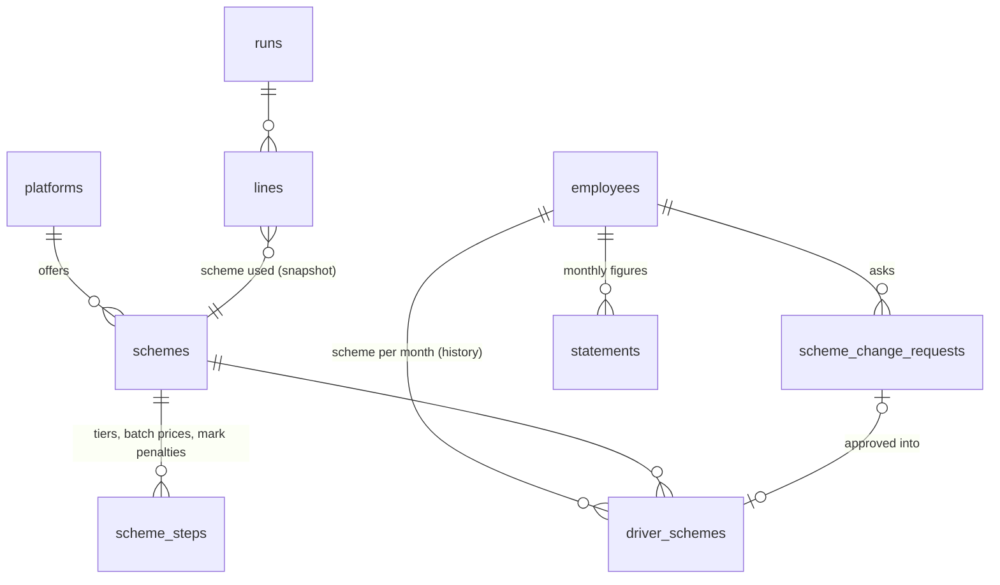

# Pay schemes per platform, tiers and penalties, and scheme change requests

Design for the next payroll step. It extends the payroll module that already exists (`backend/app/modules/payroll`,
PostgreSQL schema `payroll`); it does not start a new system.

**Status: built**, as migration `0018_pay_schemes`, and **the client's decisions A to J are final** (section 6, all
DECIDED; each is pinned by a worked month in `tests/test_payroll_decisions.py`). Since then: terms by version from a
month (section 7, `0046_scheme_versions`), the uncollected deductions balance (section 8), the driver's objection on a
payslip (section 9) and the reconciliation gate before any real approval (section 10).
- `calculators.py` (the strategies) and `schemes.py` (schemes, assignment by month, requests);
- the dashboard: Payroll → "أنظمة الدفع" and "طلبات تغيير النظام", the scheme in the employee's file and as a bulk
  action on the employees list, the scheme's figures in the platform statement, and how the scheme computed each line;
- the driver app: the "نظام الدفع" screen (terms, request, cancel) and the choice in self-registration.

Two things differ from the text below: the office assigns the scheme from the employee's file (or many drivers at once
from the list), not inside the employee form; and the driver's view carries the terms only, not how many drivers are on
each scheme. The defaults are still the client's to confirm before the first real month.

## 0. Where this fits

**Stack.** The request mentions Laravel or Node.js. The backend is FastAPI on PostgreSQL 16, and payroll already runs on it:
- platforms as data, built from the client's salary template;
- the driver's monthly statement, with screenshots and a review step;
- monthly runs, with installments under the cap, approval, a lock and reopen;
- the Excel export in the client's own columns, and the payslip in the app.

Rewriting this in another language would throw away work that is tested and running. Everything below is the same
module, in its conventions:
- forward-only SQL migrations;
- `snake_case` constraint names;
- money as `numeric(12,3)` (KWD, fils);
- names as `{"ar", "en"}`.

**What changes.**

| Today | After |
|---|---|
| One pay rule per platform: basic salary yes/no, a rate per order, per hour and per valid day, and the invalid-days rule | A platform has one or more **schemes**, and each driver has a scheme per month |
| — | Each scheme names a **calculator** (the strategy) and holds its numbers |
| — | Today's per-platform rule becomes a `platform_rates` calculator, so nothing that works today changes |

**Strategies by the shape of the rule, not by platform name.** A `KeetaStrategy` class would put a platform's name
and prices in code. The project forbids that (`tests/test_architecture.py`: client and platform names are data), and
it would mean a code change every time Keeta moves a price. Talabat also has two shapes (batch and fixed price). So:

| Calculator | Shape | Used by |
|---|---|---|
| `platform_rates` | basic + per order + per hour + per valid day, and the invalid-days rule (today's engine) | existing platforms |
| `per_order` | one price per order, and an optional missing-target deduction | Talabat fixed price 1, 2, 3 |
| `batch` | the price per order depends on the month's batch level | Talabat batch system |
| `tiered_target` | base price, tier bonuses, missing-target deduction, attendance marks, reduced price | Keeta |

What needs code and what does not:
- **A new platform** whose rules fit one of these shapes needs no code. It is rows in `schemes` and
  `scheme_steps`, entered from the dashboard.
- **A new shape** of rule needs one new class, registered in one dictionary, plus its name added to the column's
  CHECK constraint. The run engine does not change.

## 1. Schema



**Configuration** (business rules, changed by the office, never by a payroll run):

```sql
-- migration 0018_pay_schemes (forward-only, ends with SELECT public.fleet_apply_grants();)

CREATE TABLE payroll.schemes (
    id                    bigint GENERATED ALWAYS AS IDENTITY CONSTRAINT schemes_pkey PRIMARY KEY,
    public_id             uuid NOT NULL DEFAULT gen_random_uuid() CONSTRAINT schemes_public_id_key UNIQUE,
    platform_id           bigint NOT NULL CONSTRAINT schemes_platform_id_fkey REFERENCES payroll.platforms (id),
    code                  text NOT NULL,                       -- e.g. batch, fixed_1, fixed_2, fixed_3, standard
    name                  jsonb NOT NULL,                      -- {"ar": "...", "en": "..."}
    description           jsonb,                               -- what the driver reads in the app before asking
    calculator            text NOT NULL CONSTRAINT schemes_calculator_check
                              CHECK (calculator IN ('platform_rates', 'per_order', 'batch', 'tiered_target')),
    per_order             numeric(12,3),                       -- the base price (fixed price, Keeta base)
    target_orders         integer NOT NULL DEFAULT 420,
    required_valid_days   smallint NOT NULL DEFAULT 28,
    missing_order_rate    numeric(12,3),                       -- per order short of the target; NULL: none
    reduced_rate          numeric(12,3),                       -- every order's price when the month is reduced
    -- the ambiguous rules, as data (section 6): the client's answer is a setting, not a code change
    bonus_when_reduced    boolean NOT NULL DEFAULT false,
    marks_when_reduced    boolean NOT NULL DEFAULT false,
    floor_at_zero         boolean NOT NULL DEFAULT true,
    company_covers        text[] NOT NULL DEFAULT '{}' CONSTRAINT schemes_company_covers_check
                              CHECK (company_covers <@ ARRAY['maintenance','housing','gas','sim']),
    driver_selectable     boolean NOT NULL DEFAULT true,       -- offered in the app
    is_active             boolean NOT NULL DEFAULT true,
    created_by            bigint NOT NULL,
    created_at            timestamptz NOT NULL DEFAULT now(),
    CONSTRAINT schemes_platform_id_key UNIQUE (platform_id, code),
    CONSTRAINT schemes_rates_check CHECK (
        (calculator <> 'per_order'     OR per_order IS NOT NULL) AND
        (calculator <> 'tiered_target' OR (per_order IS NOT NULL AND reduced_rate IS NOT NULL)))
);

-- list-shaped rules, one table: a threshold and what it gives
CREATE TABLE payroll.scheme_steps (
    scheme_id  bigint NOT NULL CONSTRAINT scheme_steps_scheme_id_fkey REFERENCES payroll.schemes (id) ON DELETE CASCADE,
    kind       text NOT NULL CONSTRAINT scheme_steps_kind_check
                   CHECK (kind IN ('batch_rate', 'tier_bonus', 'marks_deduction', 'marks_reduce')),
    threshold  numeric(12,3) NOT NULL,   -- batch level | minimum orders | minimum marks
    amount     numeric(12,3),            -- price per order | bonus | deduction | (none for marks_reduce)
    CONSTRAINT scheme_steps_pkey PRIMARY KEY (scheme_id, kind, threshold),
    CONSTRAINT scheme_steps_amount_check CHECK ((kind = 'marks_reduce') = (amount IS NULL))
);
```

**A scheme's terms change by version, each from a month (section 7).** A run pays each month on the version of its own
month, so a draft recomputed later never picks up a price the month did not have, and approved runs are locked in
their cells anyway. Only the calculator (the shape of rule) never changes once the scheme is used: another shape is a
new scheme, and the office moves the drivers to it from a month, in one bulk action.

**Assignment and requests** (who is on what, and when):

```sql
CREATE TABLE payroll.scheme_change_requests (
    id                   bigint GENERATED ALWAYS AS IDENTITY CONSTRAINT scheme_change_requests_pkey PRIMARY KEY,
    public_id            uuid NOT NULL DEFAULT gen_random_uuid() CONSTRAINT scheme_change_requests_public_id_key UNIQUE,
    employee_id          bigint NOT NULL CONSTRAINT scheme_change_requests_employee_id_fkey REFERENCES people.employees (id),
    company_id           bigint NOT NULL,
    current_scheme_id    bigint CONSTRAINT scheme_change_requests_current_scheme_id_fkey REFERENCES payroll.schemes (id),
    requested_scheme_id  bigint NOT NULL CONSTRAINT scheme_change_requests_requested_scheme_id_fkey REFERENCES payroll.schemes (id),
    effective_month      date NOT NULL,                      -- first day of the month it would apply from
    status               text NOT NULL DEFAULT 'pending' CONSTRAINT scheme_change_requests_status_check
                             CHECK (status IN ('pending', 'approved', 'rejected', 'cancelled')),
    driver_note          text,
    admin_note           text,                               -- required to reject (service)
    submitted_by_device  bigint,
    decided_by           bigint,
    decided_at           timestamptz,
    created_at           timestamptz NOT NULL DEFAULT now(),
    version              integer NOT NULL DEFAULT 1,
    CONSTRAINT scheme_change_requests_month_check CHECK (extract(day FROM effective_month) = 1),
    CONSTRAINT scheme_change_requests_change_check CHECK (requested_scheme_id IS DISTINCT FROM current_scheme_id),
    CONSTRAINT scheme_change_requests_decided_check CHECK ((status IN ('pending', 'cancelled')) = (decided_at IS NULL))
);
-- one open request per driver
CREATE UNIQUE INDEX scheme_change_requests_employee_id_idx
    ON payroll.scheme_change_requests (employee_id) WHERE status = 'pending';

CREATE TABLE payroll.driver_schemes (
    id           bigint GENERATED ALWAYS AS IDENTITY CONSTRAINT driver_schemes_pkey PRIMARY KEY,
    employee_id  bigint NOT NULL CONSTRAINT driver_schemes_employee_id_fkey REFERENCES people.employees (id),
    scheme_id    bigint NOT NULL CONSTRAINT driver_schemes_scheme_id_fkey REFERENCES payroll.schemes (id),
    valid_from   date NOT NULL,                              -- first day of a month
    valid_to     date,                                       -- exclusive, first day of a month; NULL: still on it
    source       text NOT NULL CONSTRAINT driver_schemes_source_check
                     CHECK (source IN ('office', 'registration', 'request', 'import')),
    request_id   bigint CONSTRAINT driver_schemes_request_id_fkey REFERENCES payroll.scheme_change_requests (id),
    set_by       bigint,
    set_at       timestamptz NOT NULL DEFAULT now(),
    CONSTRAINT driver_schemes_month_check CHECK (extract(day FROM valid_from) = 1 AND
                                                 (valid_to IS NULL OR (extract(day FROM valid_to) = 1 AND valid_to > valid_from))),
    -- btree_gist is already installed (0001); custodies use the same guarantee
    CONSTRAINT driver_schemes_overlap EXCLUDE USING gist
        (employee_id WITH =, daterange(valid_from, valid_to) WITH &&)
);
```

Two rules the database cannot hold, so the service checks them in the same transaction:
- A scheme's platform must be the driver's platform (`people.employees.platform_id`).
- A month that already has an approved run cannot be reassigned.

**Transactional** (the month's figures and the result). These extend tables that already exist:

```sql
ALTER TABLE payroll.statements                  -- the monthly performance, reviewed before payroll
    ADD COLUMN batch_level       smallint,      -- Talabat batch system: from Talabat's partner report
    ADD COLUMN attendance_marks  smallint,      -- Keeta: from Keeta's partner report
    ADD COLUMN star_day_failed   boolean;       -- Keeta: from Keeta's partner report

ALTER TABLE payroll.lines
    ADD COLUMN scheme_id  bigint CONSTRAINT lines_scheme_id_fkey REFERENCES payroll.schemes (id),
    ADD COLUMN breakdown  jsonb NOT NULL DEFAULT '[]'::jsonb;  -- the calculator's items: code, amount, why
```

**The month's orders and valid days come from the driver's approved daily reports.** At the end of each day the
driver sends a screenshot of his day from the platform's app, with what his platform asks for:
- **Talabat:** orders, and cash if any.
- **Keeta:** orders, and whether the day counted (valid day).

This is built: `payroll.platforms.daily_fields` and `daily_ops.reports.valid_day`. The month sums the approved
reports, and a report waiting for review blocks the line (`daily_pending`).

The three new figures here are monthly facts the daily report does not carry:
- the batch level;
- the attendance marks;
- a missed star day.

The reviewer enters them from the platform's partner report. A driver who declares his own attendance marks will
declare zero.

## 2. Calculators (the Strategy pattern)

```python
# app/modules/payroll/calculators.py
"""How a scheme turns a month's figures into earnings. One calculator per shape of rule, never per platform: a
platform and its schemes are data (payroll.schemes, payroll.scheme_steps) naming their calculator."""

@dataclass(frozen=True)
class Step:
    threshold: Decimal
    amount: Decimal | None


@dataclass(frozen=True)
class Rules:  # one scheme, read once per run
    per_order: Decimal | None
    target_orders: int
    required_valid_days: int
    missing_order_rate: Decimal | None
    reduced_rate: Decimal | None
    bonus_when_reduced: bool
    marks_when_reduced: bool
    floor_at_zero: bool
    steps: dict[str, list[Step]]  # by kind, sorted by threshold

    def highest(self, kind: str, value) -> Step | None:
        """The highest step reached: tiers and marks are not cumulative."""
        reached = [s for s in self.steps.get(kind, []) if value >= s.threshold]
        return reached[-1] if reached else None

    def exact(self, kind: str, value) -> Step | None:
        return next((s for s in self.steps.get(kind, []) if s.threshold == value), None)


@dataclass(frozen=True)
class Month:  # the approved statement
    orders: int
    valid_days: int | None
    batch_level: int | None
    attendance_marks: int
    star_day_failed: bool


@dataclass(frozen=True)
class Item:
    code: str        # a salary-sheet column (columns.py), so the export and the payslip show it
    amount: Decimal  # signed: earnings positive, penalties negative
    why: dict        # what the payslip says: "540 orders reached tier 3", "3 attendance marks"


class Calculator(Protocol):
    code: str
    needs: tuple[str, ...]  # statement figures without which the line is flagged and blocks approval

    def items(self, rules: Rules, month: Month) -> list[Item]: ...


CALCULATORS: dict[str, Calculator] = {}


def calculator(cls):
    CALCULATORS[cls.code] = cls()
    return cls


def earnings(rules: Rules, calc: Calculator, month: Month) -> tuple[list[Item], Decimal]:
    items = calc.items(rules, month)
    total = sum((i.amount for i in items), ZERO)
    if total < 0 and rules.floor_at_zero:
        items.append(Item("penalty_floor", -total, {"uncovered": str(-total)}))  # visible, never silent
        total = ZERO
    return items, total
```

**The run engine changes in one place.** `runs.compute()` does three things:
1. Looks up the scheme effective that month for the driver (`driver_schemes`).
2. Takes `CALCULATORS[scheme.calculator]` and calls it.
3. Stores the items in `lines.breakdown` and their codes in `lines.cells`, so the client's Excel columns and the payslip show them.

Everything after the earnings stays as it is: the month's items, the installments under the cap, the net that is
never negative, approval and the lock.

A missing figure stops approval the same way a missing statement does today. For example, the batch level of a batch
driver flags the line `batch_level_missing`, and the flag blocks approval. Nothing is guessed.

## 3. Requests from the app, decisions in the dashboard

**First entry (office or self-registration).** The office picks the **platform**. The company registered the driver
with Talabat or Keeta, and it holds his platform driver ID. Then it picks the **scheme**, from the active schemes of
that platform. The form shows each scheme's terms: price, tiers, penalties, and who pays for gas, SIM, maintenance and
housing.

In self-registration the driver picks among his platform's `driver_selectable` schemes. His choice goes through the
registration review that already exists, and approving the registration writes the first `driver_schemes` row
(`source = 'registration'`) from the current month. A driver with no scheme flags his payroll line
`scheme_missing`, which blocks approval.

**Driver (app):**

| Call | What it does |
|---|---|
| `GET /driver/schemes` | His platform's active, driver-selectable schemes with their terms, his current scheme, and his open request if any |
| `POST /driver/scheme-requests {scheme_id, note}` | Checks the scheme is active, on his platform, selectable and not his current one (else 422).<br>Refuses a second open request (409, from the unique index).<br>Sets `effective_month` to the first day of the next month.<br>Inserts `pending`, alerts the reviewers (the dashboard badge), audits, returns 201. |
| `DELETE /driver/scheme-requests/{id}` | Cancels his own pending request |

**Dashboard** (new permission `payroll.schemes`):

| Call | What it does |
|---|---|
| `GET /scheme-requests?status=pending` | The queue, with each driver's current and requested scheme side by side, and the badge count |
| `POST /scheme-requests/{id}/approve {effective_month?, note}` | One transaction, steps below |
| `POST /scheme-requests/{id}/reject {note}` | The note is required. Status becomes `rejected`, the driver is notified, the request is audited. |

What approve does, in its one transaction:
1. Locks the request and checks it is still `pending`. The `version` field gives optimistic locking against two reviewers.
2. Re-checks the scheme: still active, still on the driver's platform. Either may have changed since the request.
3. Sets `effective_month`. It defaults to the request's month, and may be later, never earlier. It is refused if that month already has an approved run for his company.
4. Closes the open `driver_schemes` row at `effective_month` and inserts the new one (`source = 'request'`, `request_id`).
5. Sets the request to `approved` with `decided_by` and `decided_at`, audits it, and notifies the driver: "from 1 November your scheme is …".

A request approved after its month has started moves to the next month that has no approved run. The dashboard says
so before saving.

A change of **platform** (Talabat ↔ Keeta) is not a driver request. It changes the platform driver ID and usually the
vehicle, so it is an office action with its own effective month.

## 4. The Keeta calculator

```python
@calculator
class TieredTarget:
    """Base price per order, a bonus for the highest tier reached, a deduction per order short of the target,
    deductions for attendance marks, and a reduced price for every order when the marks pass a limit or a mandatory
    star day was missed."""

    code = "tiered_target"
    needs = ("orders", "attendance_marks", "star_day_failed")

    def items(self, rules: Rules, month: Month) -> list[Item]:
        out: list[Item] = []
        reduce_at = rules.highest("marks_reduce", month.attendance_marks)  # e.g. threshold 5: more than 4 marks
        reduced = month.star_day_failed or reduce_at is not None
        rate = rules.reduced_rate if reduced else rules.per_order
        out.append(Item("orders_pay", money(month.orders * rate), {
            "orders": month.orders, "rate": str(rate),
            "reduced_by": "star_day" if month.star_day_failed else "marks" if reduce_at else None,
        }))

        if not reduced or rules.bonus_when_reduced:
            tier = rules.highest("tier_bonus", month.orders)
            if tier:
                out.append(Item("tier_bonus", tier.amount, {"orders": month.orders, "from": int(tier.threshold)}))

        missing = max(0, rules.target_orders - month.orders)
        if missing and rules.missing_order_rate:  # the scheme's rate, not the reduced one (section 6)
            out.append(Item("missing_target", -money(missing * rules.missing_order_rate), {
                "target": rules.target_orders, "missing": missing, "rate": str(rules.missing_order_rate),
            }))

        if not reduced or rules.marks_when_reduced:
            mark = rules.highest("marks_deduction", month.attendance_marks)  # 3 -> 10, 4 -> 30
            if mark:
                out.append(Item("attendance_marks", -mark.amount, {"marks": month.attendance_marks}))
        return out
```

Keeta as data (no code):

```sql
INSERT INTO payroll.schemes (platform_id, code, name, calculator, per_order, missing_order_rate, reduced_rate, created_by)
VALUES (:keeta, 'standard', '{"ar":"كيتا الأساسي","en":"Keeta standard"}', 'tiered_target', 0.350, 0.350, 0.200, :me);
INSERT INTO payroll.scheme_steps (scheme_id, kind, threshold, amount) VALUES
  (:s, 'tier_bonus', 450, 50), (:s, 'tier_bonus', 540, 90), (:s, 'tier_bonus', 620, 130), (:s, 'tier_bonus', 710, 200),
  (:s, 'marks_deduction', 3, 10), (:s, 'marks_deduction', 4, 30),
  (:s, 'marks_reduce', 5, NULL);
```

Talabat:
- **Batch:** one `batch` scheme with steps `batch_rate` 1→0.700, 2→0.675, 3→0.600, 4→0.525, and 5, 6, 7→0.400.
  `company_covers = '{}'`.
- **Fixed price:** three `per_order` schemes:

  | Scheme | Price per order | `company_covers` |
  |---|---|---|
  | `fixed_1` | 0.350 | `{maintenance,housing,gas,sim}` |
  | `fixed_2` | 0.550 | `{maintenance,housing}` |
  | `fixed_3` | 0.680 | `{}` |

## 5. Worked months (they become the tests)

| Scheme | Month | Pay |
|---|---|---|
| Keeta | 560 orders, 2 marks | 560×0.350 = 196.000, + tier 3 (540) 90 = **286.000** |
| Keeta | 400 orders, 3 marks | 140.000 − 20 short×0.350 = 7.000 − marks 10 = **123.000** |
| Keeta | 480 orders, 5 marks | reduced: 480×0.200 = **96.000** (no tier bonus, no −30: decisions A and C) |
| Keeta | 800 orders, 5 marks | reduced: 800×0.200 = **160.000** (no tier bonus, no −30, no shortfall) |
| Keeta | 400 orders, 5 marks | reduced: 400×0.200 = 80.000 − 20 short×0.350 = 7.000 = **73.000** (B, C) |
| Keeta | 300 orders, star day missed | 60.000 − 120×0.350 = 42.000 → **18.000** |
| Keeta | 100 orders, star day missed | 20.000 − 320×0.350 = 112.000 → **−92.000 → 0 (D), 92.000 an uncollected line for review** |
| Talabat batch | level 2, 450 orders | 450×0.675 = **303.750** |
| Talabat fixed 2 | 380 orders | 380×0.550 = **209.000**, no missing-target deduction (F) |
| Talabat fixed 3 | 400 orders | 400×0.680 = **272.000**, nothing for the 20 short of 420 (F) |

## 6. The client's decisions (DECIDED)

Each was a setting with a default; the client's final answers are below, and the code and the defaults match them.
`tests/test_payroll_decisions.py` pins each one with a worked month through the whole run, on schemes set up with the
panel's defaults.

| # | Question | Decision | Where it lives |
|---|---|---|---|
| A | Keeta, reduced month (price → 0.200): is the tier bonus still paid? | **DECIDED: no tier bonus.** | `bonus_when_reduced = false` (column default and panel default) |
| B | Keeta: missing-target deduction when the price fell to 0.200? | **DECIDED: 0.350 per missing order, even on a reduced month.** | the scheme's `missing_order_rate` (0.350 on the Keeta scheme), never `reduced_rate` |
| C | Keeta, more than 4 marks: −30 on top of the reduced price? | **DECIDED: only the reduced price, no −30;** the missing-target deduction still applies. | `marks_when_reduced = false` |
| D | Penalties larger than the month's pay? | **DECIDED: the net never goes below zero; the remainder is an "uncollected deductions balance" line for review, never carried automatically.** The accountant carries a line to next month (a manual deduction, with `payroll.approve` and a note) or drops it with a note (section 8). | the run (every line), and `floor_at_zero` for the scheme's own penalties |
| E | Fewer than 28 valid days? | **DECIDED: no extra automatic deduction;** the target and the star-day rules still apply. | a scheme ignores the platform's invalid-days rule and the absence rule; `required_valid_days` is informational |
| F | Talabat missing-target deductions? | **DECIDED: none.** | Talabat's schemes have no `missing_order_rate` (the column's default is none) |
| G | Driver-borne gas, SIM, maintenance, housing? | **DECIDED: informational only (who is responsible); never deducted automatically.** | `company_covers` only decides whether a fuel claim is accepted; payroll never reads it |
| H | Keeta tiers: highest or cumulative? | **DECIDED: the highest reached only.** | `Rules.highest` |
| I | Can a batch level change within a month? | **DECIDED: one level for the whole payroll month;** a change starts from an approved effective month. | one `batch_level` per statement; a driver's scheme moves from a month (request approved, or the office), the batch prices by version (section 7) |
| J | More than one Keeta scheme? | **DECIDED: one scheme now;** another can be added later from the panel (Payroll → Pay schemes → New scheme), no code. | `UNIQUE (platform_id, code)` only |

## 7. Terms by version, from a month

`payroll.scheme_versions` holds every version of a scheme's terms: the prices, the target, the missing-order rate,
the reduced price, the decisions' flags, who bears what, and the steps (tiers, batch prices, marks) as one JSON list.
Each version applies from its `effective_month` until the next version's month; the first version also covers any
month before it. The columns on `payroll.schemes` and its `scheme_steps` mirror the latest version.

- **A run reads the version of its own month** (`schemes.rules_for(…, month)`), and the line keeps the version number
  (`lines.scheme_version`). A draft of an older open month recomputed after a change keeps that month's terms.
- **A change of terms is a new version** from the month the office picks in the editor («يسري من شهر»). The month is
  never before the first month no approved (or paid) payroll paid on the scheme, and never before the latest version;
  from the latest version's own month, that version (not paid on yet) is replaced. The same terms again make no
  version. Refused months answer 409 `scheme_version_month` with the earliest allowed month.
- **The calculator never changes once the scheme is used** (409 `scheme_in_use`): another shape of rule is another
  scheme. A scheme nobody was ever on is simply redefined (one version).
- A driver put on a scheme from a month before its first version takes the first version back to that month, so a
  later version can never reach a month the driver was already on it.
- The migration made every existing scheme's terms its version 1, from its creation month (Kuwait time) or the
  earliest month a driver was put on it or a run used it, whichever is earlier; existing lines are on version 1.
- A run being prepared or approved holds the schemes and versions it reads (FOR SHARE) until it is saved; a change of
  terms locks the scheme (FOR UPDATE) and reads what was paid after the lock, so a change for the month being approved
  waits for that approval and is then refused.
- The panel's scheme card shows this month's version and a version already set for a later month; the editor starts
  from the latest version, asks «يسري من شهر» (the earliest month offered) and a reason, and lists every version.
- Who bears what (`company_covers`) follows the version of the month too: the fuel claims of a month read it.

## 8. The uncollected deductions balance (decision D)

**The net never goes below zero.** In each line the month's penalties are taken in full while the pay covers them: a
scheme's own penalties (the scheme's `floor_at_zero` keeps them within the scheme's pay), the invalid days, the absence
deduction and the month items from the statement (cancelled orders, the platform's deductions, late, cash shortage).
What the pay cannot cover is the line's uncollected balance: the `uncovered_penalty` cell, the flag `uncollected`
(not blocking: such a month is approved like any other) and, on a scheme, the payslip's last item. Installments under
the cap still move to the next month by themselves (FR-PAY-03); the uncollected balance never does.

`payroll.uncollected` (migration `0047_uncollected`) gets one line per employee when the run is **approved** (a draft is
recomputed at will): the run, the driver, the month, the amount, and why (the month's penalties and what it earned).
Status «للمراجعة» (`review`) until an accountant with `payroll.approve` decides it, always with a written note:

| Decision | What it does |
|---|---|
| «تُرحّل للشهر التالي» (`carried`) | a manual deduction of the amount (source `other`, one installment) from the month after the run's, or this month for an old run, approved by this decision; the driver gets the usual deduction notice |
| «إسقاط» (`dropped`) | nothing more is taken |

Every line recorded and every decision is audited (`uncollected.recorded`, `.carried`, `.dropped`, `.reset`). The
approved run never changes. A decision locks the run's row first and is refused unless the run stands approved (409
`run_not_approved`). Reopening a run (which locks the same row) takes all its lines back: a carried line's deduction is
cancelled (nothing of it was taken, since a run is reopened only while no later month is approved; if anything was,
the reopening is refused with 409 `uncollected_carried_taken`), and the next approval records the balance afresh on
the corrected figures. So nothing is carried twice, nor on an amount the month no longer has.

| Call | Permission |
|---|---|
| `GET /payroll/uncollected?month=&status=&employee_id=` (per month, per driver) and `/payroll/uncollected/counts` | `payroll.view` |
| `POST /payroll/uncollected/{id}/carry {note}`, `POST /payroll/uncollected/{id}/drop {note}` | `payroll.approve` |

Panel: Payroll → «خصومات غير محصلة» (count badge): month filter, status chips, search by driver, the balance under
review per driver, and the decision drawer. The run page says which lines have an uncollected balance.

## 9. The driver's objection to a payslip

`payroll.objections` (migration `0048_objections`): the payslip (the driver's line in an approved or paid run, named by
the run, since a reopened run rebuilds its lines), the item objected to or none for the whole payslip, the amount the
payslip showed for it, his reason (required), an optional attachment (a photo or a PDF this phone uploaded, from the
camera or the gallery), the status `open → in_review → accepted | rejected → closed`, the office's response (required
to accept or reject), the action taken (free text, and an optional link to the settlement deduction), who handled it
and when.

- **Items**: a scheme item of the payslip (`orders_pay`, `tier_bonus`, `missing_target`, `marks_deduction`, …), any
  non-zero amount of the sheet (plus the gross and the net), or one installment deduction taken (`deduction:<id>`).
  Anything else is 422 `objection_item_invalid`.
- **Scope**: a driver objects only to his own approved payslips (another's, or a draft, is 404 `payslip_not_found`)
  and lists only his own objections. A resend from the app's outbox is recognised by its `client_ref` (409
  `objection_exists`).
- **Office**: Payroll → «الاعتراضات» (count badge of those waiting; filters by status and month). `payroll.view`
  sees them (and the alert raised for each new one); `payroll.prepare` or `payroll.approve` answers. The drawer shows
  the payslip line as approved, the attachment, the answer form, and «إنشاء تسوية», which opens the existing manual
  deduction form for the next month and links what it creates.
- **Driver**: on the payslip screen, «اعتراض على الكشف» and a flag on every line open the form (reason, optional
  photo); «اعتراضاتي» lists them with their status and the office's answer; a notice arrives at each change of
  status.
- **An approved run is never edited by an objection.** The existing deductions module has no positive adjustment, so
  money owed to the driver is recorded as the action taken (for example a bonus on next month's statement); money
  owed by him is the linked manual deduction.

| Call | Who |
|---|---|
| `POST /driver/payslips/{run_id}/objections {item_code?, reason, attachment_sha256?, client_ref}`, `GET /driver/objections`, `GET /driver/objections/{id}/attachment` | the driver (app screen `payslips`) |
| `GET /payroll/objections?status=&month=`, `/counts`, `/{id}`, `/{id}/attachment` | `payroll.view` |
| `POST /payroll/objections/{id}/respond {status, response?, action_taken?, deduction_id?}` | `payroll.prepare` or `payroll.approve` |

## 10. The reconciliation gate

Nothing real is approved before one month is compared against a previous month's sheet of the client. The payroll
settings carry `live_approval_enabled`, **false by default and for existing installs** (migration `0049_payroll_gate`
writes it into a stored payroll section):

- While it is false, runs are prepared, recomputed, reviewed and exported as usual, but approving one (from the run
  page or from the approvals inbox) is refused with 409 `payroll_not_reconciled`: «اعتماد المسيرات متوقف لحد ما يتعمل
  اختبار المطابقة مع كشف شهر سابق. فعّله من الإعدادات بعد المطابقة.» The flag is read from the database at each
  approval, so closing it holds at once.
- Only the owner changes it: the superuser or a user with a role carrying the `all_permissions` flag (a custom role
  with every permission ticked is not the owner). Anyone else
  with `settings.update` gets 403 `owner_only` when the value would change; leaving it out of a save keeps it as it is,
  so the rest of the payroll settings are saved as before. The change is audited with the settings.
- The panel shows a banner on the payroll page and on a draft run while it is off (`GET /payroll/gate`, with
  `payroll.view`); in the settings the switch is disabled for everyone but the owner (`/auth/me` says
  `all_permissions`).
- Tests that approve runs turn it on in their setup (`payroll_live` fixture, `api.payrollLive()` in the e2e fixtures);
  the check itself is never relaxed.

## 11. Order of work

| Step | What | Size |
|---|---|---|
| 1 | Migration 0018, models, the four calculators (`platform_rates` reproducing today exactly, so the existing payroll tests pass unchanged), the worked months as tests | backend |
| 2 | Schemes in the dashboard: under each platform, the terms and the steps; "move drivers to a scheme from a month" | panel |
| 3 | Assignment in the employee form and in self-registration | panel + app |
| 4 | Requests: app screen (schemes, request, status), dashboard queue with approve and reject, notifications | app + panel |
| 5 | Month review: batch level, marks, star day entered by the reviewer (orders and valid days already come from the daily reports); the export columns and the payslip lines | panel + app |

Steps 1 and 5 settle the money. Steps 2 to 4 settle who is on what. A to J are answered (section 6); nothing real is
approved until one month is compared against the client's own sheet (section 10).
